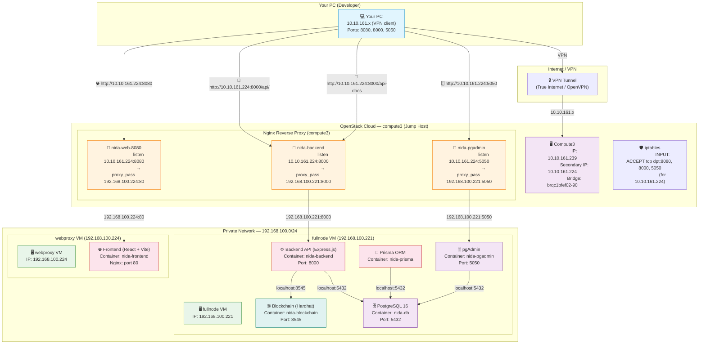

# NIDA Smart Grid — Network Architecture Diagram

## Physical Network Topology



## URL Access Summary

| Service | External URL (from PC) | Backend Target | Container | VM |
|---------|----------------------|---------------|-----------|-----|
| **Frontend UI** | `http://10.10.161.224:8080` | `192.168.100.224:80` | `nida-frontend` | webproxy |
| **Backend API** | `http://10.10.161.224:8000/api/` | `192.168.100.221:8000` | `nida-backend` | fullnode |
| **Swagger UI** | `http://10.10.161.224:8000/api-docs` | `192.168.100.221:8000` | `nida-backend` | fullnode |
| **pgAdmin** | `http://10.10.161.224:5050` | `192.168.100.221:5050` | `nida-pgadmin` | fullnode |

## VM & IP Reference

| Hostname | Private IP | OpenStack IP | Role | Running Containers |
|----------|-----------|-------------|------|-------------------|
| **compute3** | — | `10.10.161.239` (primary) | Jump host + Reverse proxy | Nginx (system) |
| | — | `10.10.161.224` (secondary) | Public-facing IP for services | — |
| **bc-fullnode** | `192.168.100.221` | — | Backend + Blockchain + DB + pgAdmin | `nida-backend`, `nida-blockchain`, `nida-db`, `nida-pgadmin`, `nida-prisma` |
| **bc-webproxy** | `192.168.100.224` | — | Frontend | `nida-frontend` |

## Docker Compose Profiles

| Profile | VM | Containers |
|---------|-----|-----------|
| `node` | fullnode (221) | `blockchain`, `backend` |
| `proxy` | webproxy (224) | `frontend` |
| `fullnode` | fullnode (221) | `pgadmin` (extra) |
| *(manual)* | fullnode (221) | `db`, `prisma` |

## Traffic Flow Example (Login)

```
Browser → http://10.10.161.224:8080
  ↓ (TCP 8080)
Compute3 nginx (10.10.161.224:8080)
  ↓ (proxy_pass)
Webproxy VM (192.168.100.224:80) → nida-frontend (React SPA)
  ↓
JS calls http://10.10.161.224:8000/api/users/login
  ↓ (TCP 8000)
Compute3 nginx (10.10.161.224:8000)
  ↓ (proxy_pass)
Fullnode VM (192.168.100.221:8000) → nida-backend
  ↓ (Prisma query)
Fullnode VM localhost:5432 → nida-db (PostgreSQL)
```
